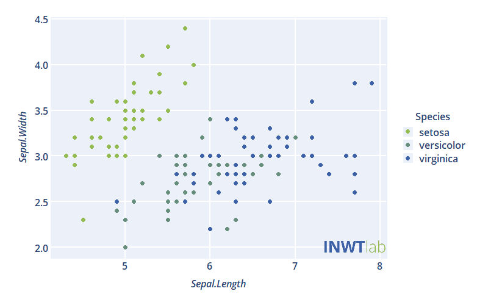
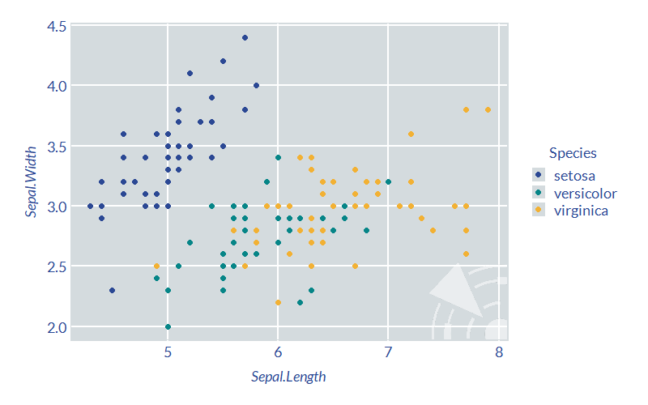
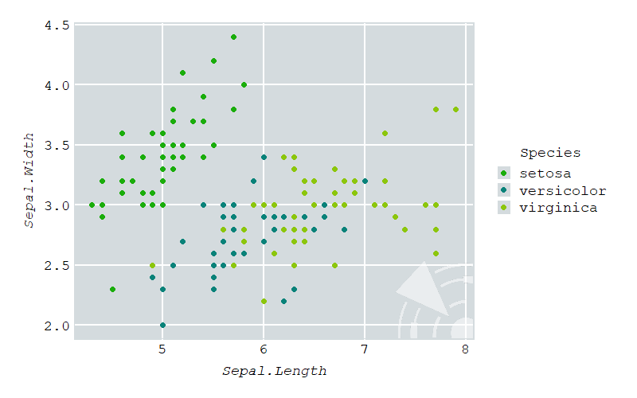

# ggCorpIdent


## About
ggCorpIdent is a package for customizing ggplot2 graphics in R easily and without touching the plot code itself. It lets you use custom colors in the plot, which are interpolated if you have not specified as much colors as needed. You can add custom fonts for the text elements within the plot and embed your corporate logo. 



## Getting Started

Install the ggCorpIdent package here from GitHub. If you have not installed devtools yet, please do that first.

```r
# install.packages("devtools")
devtools::install_github("INWTlab/ggCorpIdent")
```
For the default ggCorpIdent style call the function `ggCorpIdent()` before you call the actual ggplot2 plot function. 

```r
library(ggCorpIdent)

ggCorpIdent()

ggplot(iris, aes(x = Sepal.Length, y = Sepal.Width, col = Species)) +
  geom_point()
```



To use custom colors, fonts or your corporate logo edit the corresponding arguments of `ggCorpIdent()`. Here is an example configuration, that makes use of the logo included in this package: 

```r
logoFromPackage <- system.file("logo/logo_INWT.png", package = "ggCorpIdent", mustWork = TRUE)

ggCorpIdent(base_family = "Courier New",
            textColor = "#000000",
            colors = c("#1AAD0B", "#088279", "#8CC60C"),
            logo = logoFromPackage,
            logoSize = 0.25,
            logoTransparency = 0.5)

ggplot(iris, aes(x = Sepal.Length, y = Sepal.Width, col = Species)) +
  geom_point()
```



## More Details
For more details see `?ggCorpIdent` or take a look at the package vignette. To include the vignette into the package make sure to specify it in the installation process as follows. 

```r
devtools::install_github("INWTlab/ggCorpIdent", 
                         build_opts = c("--no-resave-data", "--no-manual"), 
                         build_vignettes = TRUE)
```
Then you can access the vignette via

```r
browseVignettes(package="ggCorpIdent")
```

